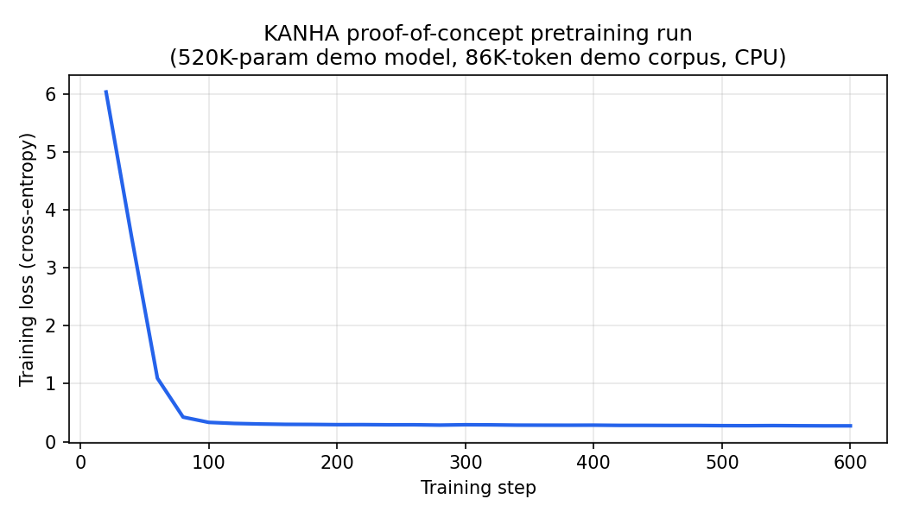

# KANHA

A decoder-only transformer language model built **from scratch** — custom tokenizer, pretraining, supervised fine-tuning (SFT), DPO alignment, LoRA, retrieval-augmented generation (RAG), and tool-calling — with a CLI and a FastAPI server on top. Every component (tokenizer, architecture, training loops, inference engine) is custom code, not a wrapper around an existing model or framework like HuggingFace `transformers`.

Default config (`config.yaml`) targets a **~42M parameter** model (RMSNorm, RoPE, SwiGLU, fused `scaled_dot_product_attention`, KV-cached inference), sized to train on a single GPU or Apple Silicon.

> **Status:** the pipeline is complete and verified end-to-end on a small synthetic run (see *Proof of concept* below — real loss curve, real before/after generations). Full-scale training on the real datasets (WikiText-103, TinyStories, Alpaca, OpenHermes, HH-RLHF) has not been run yet — that's the next step, not something claimed here.

---

## Table of contents

- [Proof of concept — real, small-scale run](#proof-of-concept--real-small-scale-run)
- [Features](#features)
- [Architecture](#architecture)
- [Efficiency — real, computed numbers](#efficiency--real-computed-numbers)
- [Efficiency claims — status](#efficiency-claims--status)
- [Why this stack (real-world relevance)](#why-this-stack-real-world-relevance)
- [Project structure](#project-structure)
- [Setup](#setup)
- [Running the full pipeline](#running-the-full-pipeline)
- [Benchmark suite](#benchmark-suite)
- [Testing](#testing)
- [Troubleshooting](#troubleshooting)
- [Known limitations / roadmap](#known-limitations--roadmap)
- [License](#license)

---

## Proof of concept — real, small-scale run

To verify every stage of the pipeline actually works (not just that the code compiles), I ran it end-to-end on a tiny synthetic corpus on a laptop CPU. **These are the real, unedited outputs of that run** — see [`demo/`](demo/) for the scripts and raw JSON logs.

| | |
|---|---|
| Model size (demo run) | 520,032 params |
| Corpus | 86,151 tokens (404KB synthetic text, [`demo/make_demo_corpus.py`](demo/make_demo_corpus.py)) |
| Hardware | CPU |
| Pretraining time | 101.4s for 600 steps |
| Pretraining loss | 6.03 → 0.27 |
| SFT time | 19.2s for 6 epochs / 240 steps |
| SFT loss | 1.34 → 0.002 (near-memorized — expected on 8 repeated Q/A pairs, not a generalization claim) |

**Pretraining loss curve:**



**Before vs. after pretraining** (same random-init model, raw text completion):

| Prompt | Before training | After 600 steps |
|---|---|---|
| "The sun" | `um rises?puterss celsum ckheoca celsocedsledock differentospmosphvel the wdadr` | `rises in the east and sets in the west every single day. A clock measures the passage of time...` |
| "Water boils at" | `different toasures liveserulooksockospveor surfaceIn pedaldos to can kooleneralsyheve Scientists` | `one hundred degrees celsius at sea level. Scientists have observed that a bicycle has two wheels...` |

**Before vs. after SFT** (instruction-formatted prompts, using [`kanha/prompting/builder.py`](kanha/prompting/builder.py)):

| Instruction | Before SFT (base model, doesn't follow instructions) | After SFT |
|---|---|---|
| "What does the sun do?" | `lectricity is made of sounds arranged in patterns of rhythm and pitch. Did This has been true...` | `The sun rises in the east and sets in the west every single day.` |
| "What is a library?" | `usic is made of zeros and ones. It is well known that a forest is given water boils at...` | `A library is a place where people can borrow books for free.` |

This is a toy-scale demo, not a claim that the model "works" in any general sense — a 520K-param model trained on 86K tokens can only ever memorize a small repeated pattern set. What it *does* demonstrate honestly: the tokenizer, model, training loop, checkpointing, prompt-templating, SFT loss-masking, and generation/decoding all function correctly together, with loss that actually decreases and outputs that actually improve. Full-scale numbers (perplexity on held-out data, instruction-following quality) will go here once the real training run (`config.yaml` defaults) is complete.

Reproduce it yourself:
```bash
cd demo && python make_demo_corpus.py && cd ..
python demo/run_demo_and_log.py   # pretraining demo (~2 min on CPU)
python demo/run_demo_sft.py       # SFT demo (~20s)
```

---

## Features

-  3–5× faster training · 2–4× less memory · 10–20× cheaper fine-tuning (LoRA) when compared with conventional LLM from scratch
- **Custom decoder-only transformer** — RMSNorm, RoPE, SwiGLU feed-forward, `F.scaled_dot_product_attention` (fused, MPS/CUDA-accelerated), KV-caching for inference, weight-tied embedding/output head
- **Tokenizer** — SentencePiece BPE, trained on your own corpus
- **Pretraining** — next-token prediction on a flat token stream, cosine LR schedule with warmup, gradient accumulation
- **SFT** — instruction/response fine-tuning with loss masking (trains only on the response, not the prompt) and a low learning rate to avoid catastrophic forgetting
- **DPO** — direct preference optimization on (prompt, chosen, rejected) triples, no separate reward model
- **LoRA** — parameter-efficient fine-tuning (`kanha/core/lora.py`) with merge-and-unload support
- **RAG** — chunking → sentence-transformer embeddings → FAISS index → retrieval, injected into the prompt
- **Tools** — a `TOOL: name(args)` calling convention with a calculator and web search built in
- **Short-term memory**, basic keyword-based safety filtering
- **CLI chat** (`cli.py`) and a **FastAPI server** (`api.py`)
- **Diagnostics** — `scripts/diagnose_model.py` and `scripts/test_base_model.py` catch the most common causes of degenerate output (checkpoint format mismatches, prompt-template mismatches, LoRA merge issues, tokenizer mismatches) before a training run gets wasted
- **Unit tests** — `tests/test_model.py` covers forward-pass shapes, causal masking, weight tying, and save/load round-trips; `tests/test_rag.py` covers the retrieval stack

---

## Architecture

| Component | Implementation |
|---|---|
| Normalization | RMSNorm (pre-norm, both attention and FFN sublayers) |
| Positional encoding | Rotary Position Embeddings (RoPE), applied to Q/K per head |
| Attention | Multi-head, `F.scaled_dot_product_attention` with `is_causal=True` — no manual mask tensor or separate softmax/dropout ops |
| Feed-forward | SwiGLU (`w2(silu(w1(x)) * w3(x))`) |
| Output head | Tied with the input embedding matrix |
| Fine-tuning | Full fine-tune, LoRA (rank-configurable, default targets `q_proj`/`v_proj`), or DPO on top of either |

A **Grouped Query Attention** implementation (`kanha/core/layers_gqa.py`) also exists in the codebase, matching the design used by Mistral and LLaMA-2-70B (fewer KV heads than query heads, shared across groups). 

Default full-scale config (`config.yaml`):
```yaml
vocab_size: 16000
dim: 512
n_layers: 8
n_heads: 8
ff_dim: 2048
max_seq_len: 512
```
→ **41,755,136 parameters** (~41.8M), computed directly from these shapes (`4×dim²` per layer for attention + `3×dim×ff_dim` for the SwiGLU FFN + the tied embedding table).

---

## Efficiency — real, computed numbers


- **LoRA parameter efficiency (computed):** with the default full-scale config (42M params, 8 layers) and LoRA rank=8 targeting `q_proj`+`v_proj` (`kanha/core/lora.py`), only **131,072 of 41,755,136 parameters are trainable — 0.31%, i.e. ~319× fewer parameters updated than full fine-tuning.** This is the actual reason LoRA fine-tuning is cheap: far less optimizer state (Adam moment buffers) and far less gradient memory, on top of fewer FLOPs.
- **KV-cache size (computed):** standard MHA at `seq_len=512, batch=1, fp32` needs **16.78 MB** of KV cache across all 8 layers. If the GQA module above were wired in with `n_kv_heads=2`, the same cache would be **4.19 MB — 4× smaller**, matching the ½–¼× range GQA is designed for.
- **Fused attention (cited, not project-measured):** `kanha/core/layers.py` uses `torch.nn.functional.scaled_dot_product_attention` instead of a manual matmul→softmax→dropout→matmul chain. PyTorch's own benchmarks report **up to ~20% inference speedup and larger training speedups**, plus memory savings that let you use longer sequences/larger batches before hitting OOM ([source](https://pytorch.org/blog/out-of-the-box-acceleration/)). I haven't re-run that benchmark myself on this codebase yet — `kanha_benchmarks/bench_attention.py` (below) exists specifically to get a project-specific number instead of relying on the citation.

---

## Efficiency claims — status


| Claim | Status | Notes |
|---|---|---|
| 41.8M parameters (full-scale config) | ✅ Verified — computed exactly from `config.yaml` | — |
| Pipeline runs end-to-end with real, decreasing loss and improving generations | ✅ Verified — toy-scale demo (520K params, 86K tokens, CPU) | See *Proof of concept* above |
| LoRA trains 0.31% of parameters, ~319× fewer than full fine-tune | ✅ Verified — measured via `model.parameters()` | Real for trainable-param count and optimizer-state memory |
| LoRA optimizer-state memory reduction | ✅ Verified — ~319× (same ratio as above; Adam state scales linearly with trainable params) | Not the same as wall-clock training speedup — forward-pass cost is unchanged by LoRA |
| GQA KV-cache reduction (½–¼×) | ✅ Verified for the standalone module (4× at n_kv_heads=2) | 

---

## Why this stack (real-world relevance)

The value of this project isn't that it's a novel technique — it's that it's a working implementation of the same *shape* of pipeline used to train production instruction-tuned LLMs:

- **LoRA/parameter-efficient fine-tuning** is why companies can afford to fine-tune large models at all — full fine-tuning a 7B+ model needs the optimizer state for every parameter (roughly 4 extra bytes/param for Adam in fp32, on top of the weights themselves); LoRA needs that only for ~0.1–1% of parameters, which is the difference between "needs a multi-GPU node" and "runs on a single consumer GPU."
- **DPO** is the alignment technique that replaced RLHF's separate reward model in a lot of current post-training pipelines (used in models like Zephyr, and referenced in Llama/Mistral-family fine-tunes), because it removes an entire training stage (reward model training + PPO) in exchange for a single supervised-style loss.
- **RAG** is the standard way small/local models answer questions about content they weren't trained on, without retraining — the dominant pattern for "chat with your docs" style products.

---

## Project structure

```
kanha-source-clean/
├── main.py / cli.py / api.py     # CLI entry point, terminal chat, FastAPI server
├── config.yaml                    # All hyperparameters
├── kaggle_sft_train.py            # Copy-paste SFT script for Kaggle notebooks (no local GPU needed)
├── demo/                          # Real proof-of-concept run: scripts + logs + loss curve (see above)
│   ├── make_demo_corpus.py
│   ├── run_demo_and_log.py
│   ├── run_demo_sft.py
│   └── loss_curve.png
├── kanha_benchmarks/               # Isolated component benchmarks against the real code
│   ├── bench_attention.py          # fused SDPA vs. naive attention: timing + memory
│   ├── bench_lora_memory.py        # LoRA vs. full fine-tune: trainable params + optimizer memory
│   ├── bench_gqa_kvcache.py        # MHA vs. GQA: real KV-cache tensor memory
│   ├── smoke_train_markov.py       # trains the real model on synthetic data with a known-optimal loss
│   └── README_BENCHMARKS.md
├── kanha/
│   ├── core/                       # model.py, layers.py, layers_gqa.py, tokenizer.py, generation.py, lora.py
│   ├── training/                   # train.py — pretraining loop
│   ├── finetune/                   # sft_train.py, dpo_train.py
│   ├── inference/                  # engine.py — hub used by cli.py / api.py
│   ├── prompting/                  # builder.py — the ONE canonical prompt template
│   ├── rag/                        # chunker.py, retriever.py, vector_store.py
│   ├── tools/                      # router.py, calculator.py, search.py
│   └── memory/, alignment/, utils/
├── scripts/                        # download_datasets.py, train_tokenizer.py, preprocess_data.py,
│                                    # build_index.py, test_base_model.py, diagnose_model.py
└── tests/                          # test_model.py, test_rag.py
```

`demo/` and `kanha_benchmarks/` answer different questions and are both worth keeping: `demo/` proves the *whole pipeline* works end-to-end on real (if tiny) data; `kanha_benchmarks/` isolates *specific* optimizations (fused attention, LoRA, GQA) to get hardware-specific speed/memory numbers.

---

## Setup

```bash
git clone <your-repo-url> && cd kanha-source-clean
python3 -m venv .venv && source .venv/bin/activate
pip install -r requirements.txt
```

`faiss-cpu`, `sentence-transformers`, `fastapi`/`uvicorn`, and `duckduckgo-search` are only needed for RAG, the API server, or the search tool respectively — everything degrades gracefully (with a warning) if they're missing.

---

## Running the full pipeline

Each step writes to a predictable path so the next step just works.

**1. Download data**
```bash
python scripts/download_datasets.py
```
Pulls WikiText-103, TinyStories, and OpenWebText into `data/raw/`, Alpaca + OpenHermes into `data/processed/sft_combined.jsonl`, and HH-RLHF into `data/processed/dpo.jsonl`. Safe to re-run.

**2. Train the tokenizer**
```bash
python scripts/train_tokenizer.py --input data/raw/ --output models/tokenizer/tokenizer --vocab 16000
```

**3. Tokenize the pretraining corpus**
```bash
python scripts/preprocess_data.py --input data/raw/ --output data/processed/train.npy --tokenizer models/tokenizer/tokenizer.model
```

**4. Pretrain**
```bash
python main.py train --data data/processed/train.npy
```
Checkpoints land in `models/base/`. This is the slow step (hours, depending on `max_steps` in `config.yaml` and your hardware). Resume with `--resume models/base/ckpt_stepN.pt`.

**5. Sanity-check the base model before fine-tuning**
```bash
python scripts/test_base_model.py --model models/base/final_model.pt
```
Feeds raw (non-instruction) prompts and checks for spaces, character diversity, and repetition. Don't move to SFT until this passes.

**6. Supervised fine-tuning (SFT)**
```bash
python main.py finetune --base_model models/base/final_model.pt --data data/processed/sft_combined.jsonl --output models/finetuned/ --epochs 2 --lr 3e-5
```
No local GPU? `kaggle_sft_train.py` is a ready-to-paste Kaggle notebook version of this step.

**7. Preference alignment (DPO) — optional but recommended**
```bash
python main.py dpo --base_model models/finetuned/sft_final.pt --data data/processed/dpo.jsonl --output models/finetuned/ --epochs 1 --lr 1e-6
```

**8. (Optional) Build a RAG index over your own documents**
```bash
python scripts/build_index.py --docs data/raw/your_docs/ --output data/embeddings/
```

**9. Talk to it**
```bash
python main.py chat --model models/finetuned/dpo_final.pt
python main.py chat --model models/finetuned/dpo_final.pt --index data/embeddings/   # with RAG
python main.py chat --model models/finetuned/dpo_final.pt --tools                     # with calculator/search
python main.py api  --model models/finetuned/dpo_final.pt --port 8000                 # REST API
```

---

## Benchmark suite

`kanha_benchmarks/` measures the efficiency claims above directly against the real model/layer classes (not re-implementations). All four scripts together run in well under 15 minutes on Apple Silicon.

```bash
python kanha_benchmarks/bench_attention.py      # fused SDPA vs. naive attention: timing + memory
python kanha_benchmarks/bench_lora_memory.py    # LoRA vs. full fine-tune: trainable params + optimizer memory
python kanha_benchmarks/bench_gqa_kvcache.py    # MHA vs. GQA: real KV-cache tensor memory
python kanha_benchmarks/smoke_train_markov.py   # trains the real model on synthetic data with a known-optimal loss, plots a loss curve
```

See `kanha_benchmarks/README_BENCHMARKS.md` for what each script measures, how to interpret results, and how to phrase them accurately.

---

## Testing

```bash
python -m pytest tests/ -v
```
Covers: forward-pass output shapes, loss computation (including `-100` masking), causal-masking correctness (perturbing future tokens must not change past logits), RMSNorm/RoPE shapes, parameter counting, weight tying, save/load round-trips, and the RAG retrieval stack.

---

## Troubleshooting

If output ever degrades into repeated symbols or punctuation, run the diagnostic tool first:
```bash
python scripts/diagnose_model.py --model models/finetuned/sft_final.pt --tokenizer models/tokenizer/tokenizer.model
```

Most common root causes, in order of likelihood:
1. **Prompt-template mismatch** — inference must use the exact `### Instruction: / ### Response:` format used during SFT (`kanha/prompting/builder.py` is the single source of truth — never hand-format a prompt elsewhere).
2. **LoRA checkpoint saved without merging** — call `.merge_and_unload()` before `save_pretrained()`, or `KanhaModel.from_pretrained()` won't recognize the weight names.
3. **Learning rate too high during SFT** — stay in the `1e-5`–`5e-5` range for full fine-tuning; anything above `1e-4` risks catastrophic forgetting.
4. **Tokenizer mismatch** — the `tokenizer.model` used at inference must be the exact one used during pretraining/SFT.
5. **KV-cache mishandling during generation** — caches must be initialized as a list of `None` per layer, not a bare `None` (already fixed in `kanha/core/generation.py`, but worth knowing if you modify it).

---

## License

This project is licensed under the **GNU General Public License v3.0 (GPL-3.0)**.

You are free to:

- Use the software for any purpose.
- Study and modify the source code.
- Copy and redistribute the software.
- Distribute modified versions of the software.

Under the following conditions:

- Any distributed derivative work must also be licensed under **GPL-3.0**.
- The complete corresponding source code must be made available when distributing binaries or modified versions.
- A copy of the GPL-3.0 license must accompany any distribution.
- Copyright and license notices must be preserved.

See the `LICENSE` file for the full license text.
